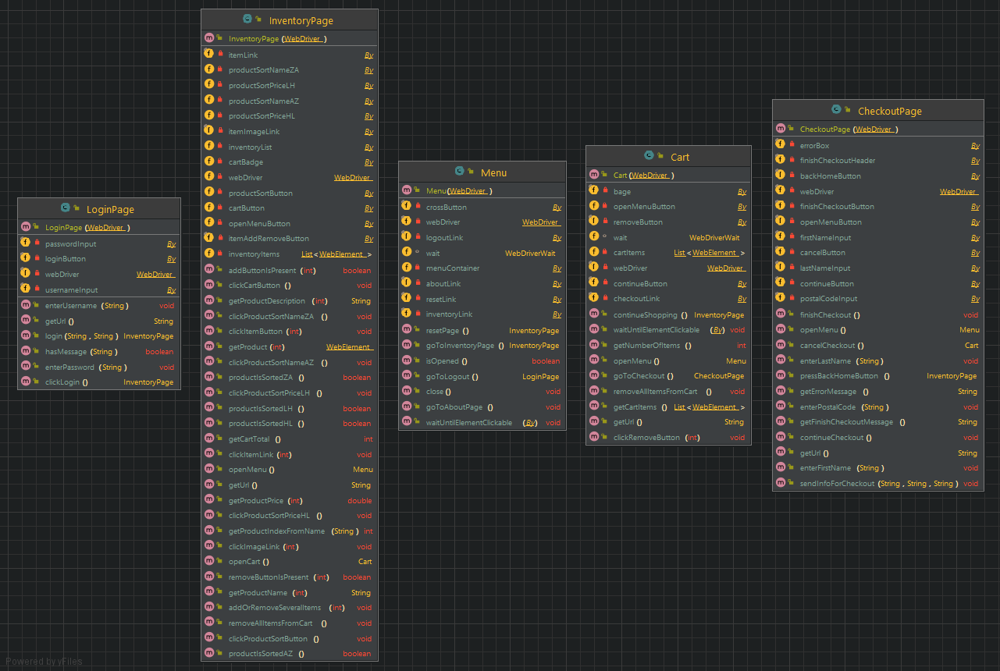

<!-- PROJECT LOGO -->
 

  

<h1 align="center">SwagLabs Project</h1>

  

     Web testing framework for the Sauce Demo website: Tests created that exercise the website's different functionalities!
     
     
    <a href="https://github.com/bxshra99/SwagLabsTesting/tree/dev/SwagLabsTesting">Project Folder</a>
    
  

## Website demo:
* Simple website- provides different login credentials.
* Successful login leads to inventory page.
* Different products can be added to the cart.
* Menu is displayed with some options.
* Products in cart are sent to checkout.

<!-- ABOUT THE PROJECT -->
## About The Project
The functionalities of the project were tested to ensure that the website is following the requirements.
Page Objective Models (poms) were created for each of the following pages:
* LoginPage
* InventoryPage
* Menu
* Cart
* CheckoutPage
    Tests were then run for each of these classes to ensure the website was working as expected.
Cucumber and gherkin were then utilised to run some behavior driven testing.

## Project objectives

* Setting up collaboratively environment to work together using GitHub.
* Creating pom’s for different web pages.
* Defining user stories and acceptance criteria.
* Create automated web tests using Selenium framework and behaviour driven testing using Cucumber and gherkin.
* Made a defect report to report each problem that was found.

### Class Diagram

### Tools used
* Java
* Intellj IDEA
* Maven
* Cucumber
* Gherkin
* Selenium

(<a href="#readme-top">back to top</a>)

<!-- CONTRIBUTING -->
## Contributing
### Pushing to GitHub repository

1. Create your branch (`git checkout -b branch`)
2. Make your changes. (using intelliji)
3. Stage your changed (`git add .`)
3. Commit your Changes (`git commit -m 'Add some branch'`)
4. Push to the Branch (`git push`)
5. Open a Pull Request

### Pulling from GitHub repository

1. Locally go on main branch (`git checkout -b dev`)
2. Pull from remote main branch to local main (`git pull`)
3. Go back to local branch to continue working (`git checkout -b branch`)

<!-- MARKDOWN LINKS & IMAGES -->
[Intellij-url]: https://img.shields.io/badge/IntelliJIDEA-000000.svg?style=for-the-badge&logo=intellij-idea&logoColor=white
[Java-url]: https://img.shields.io/badge/java-%23ED8B00.svg?style=for-the-badge&logo=java&logoColor=white
[Selenium-url]: https://img.shields.io/badge/-selenium-%43B02A?style=for-the-badge&logo=selenium&logoColor=white
[Angular-url]: https://angular.io/
[Svelte.dev]: https://img.shields.io/badge/Svelte-4A4A55?style=for-the-badge&logo=svelte&logoColor=FF3E00
[Svelte-url]: https://svelte.dev/
[Laravel.com]: https://img.shields.io/badge/Laravel-FF2D20?style=for-the-badge&logo=laravel&logoColor=white
[Laravel-url]: https://laravel.com
[Bootstrap.com]: https://img.shields.io/badge/Bootstrap-563D7C?style=for-the-badge&logo=bootstrap&logoColor=white
[Bootstrap-url]: https://getbootstrap.com
[JQuery.com]: https://img.shields.io/badge/jQuery-0769AD?style=for-the-badge&logo=jquery&logoColor=white
[JQuery-url]: https://jquery.com 
